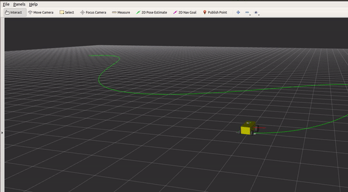

# MPC Waypoint Tracking Controller (Local Planner for ROS Navigation)

## Abstract
To move the robot on the predefined path accurately based on the plan shall be published by Global planner. 
Non linear model predictive controller shall help to calculate the cmd_vel based on the desired trajectory.
This local planner shall be used along with [WaypointsGlobalPlanner](https://github.com/balamuruganky/waypoints_global_planner).

## Dependencies
    - CppAD (included in this build)
    - Ipopt (included in this build)
    - Eigen (sudo apt install libeigen3-dev)

## How to compile (Assumed that the catkin workspace setup already)
    - cd catkin_ws/src
    - git clone https://github.com/balamuruganky/mpc_waypoint_tracking_controller
    - cd ..
    - catkin_make

## Configuration
Please refer [MoveBase Parameters](https://github.com/balamuruganky/mpc_waypoint_tracking_controller/tree/master/params/move_base)

## Caveats
    - Robot Position and orientation must be towards initial waypoint position and orientation.
    - Waypoints must be dense enough to calculate the cmd_vel.
    
## Demo
Please clone [bbblue_bot](https://github.com/balamuruganky/bbblue_bot) to run demo of [mpc_waypoint_tracking_controller](https://github.com/balamuruganky/mpc_waypoint_tracking_controller) along with [waypoints_global_planner](https://github.com/balamuruganky/waypoints_global_planner)

[roslaunch bbblue_navigation navigate_waypoints_slam.launch](https://github.com/balamuruganky/bbblue_bot/blob/master/bbblue_navigation/launch/navigate_waypoints_slam.launch)
    
## Credits
    - https://github.com/Geonhee-LEE/mpc_ros
    - https://github.com/Hypha-ROS/hypharos_minicar
    
## TODO
    - Example Rviz simulation launch file
    - Test the controller with different desired trajectories
